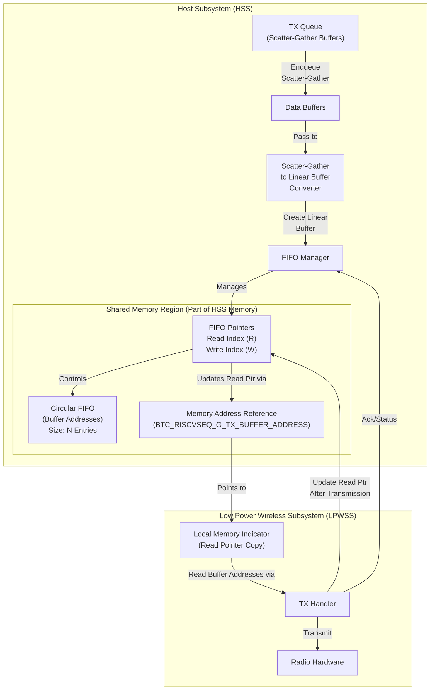
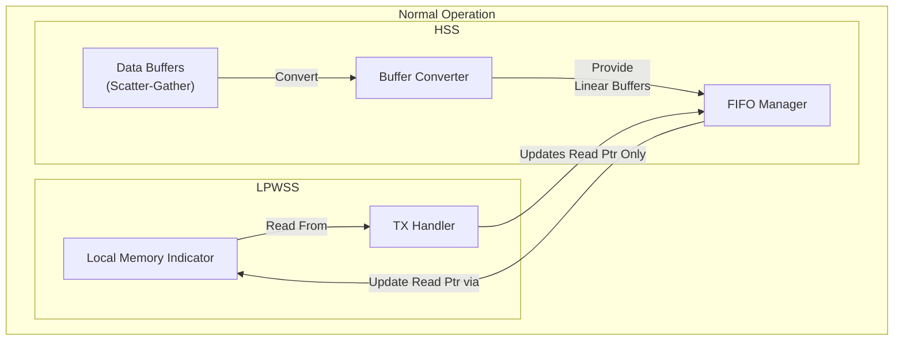
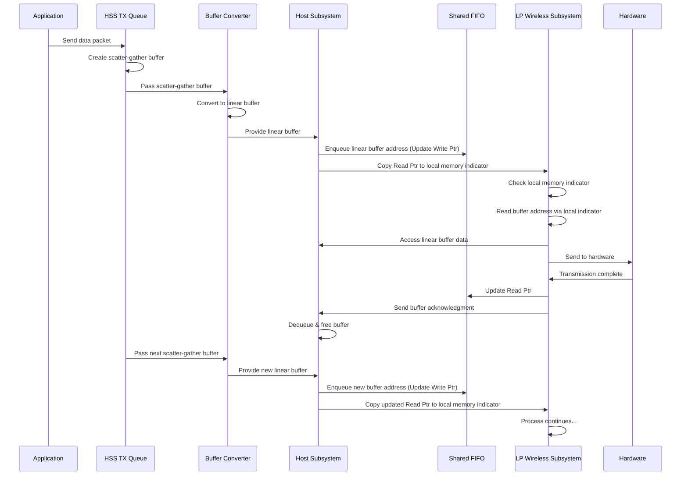
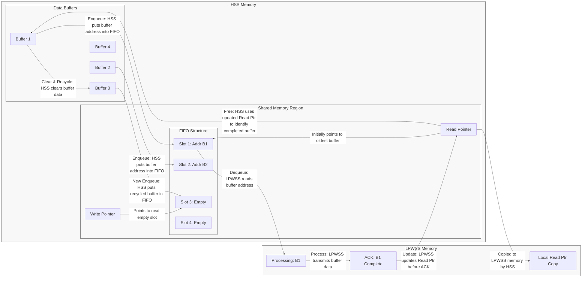
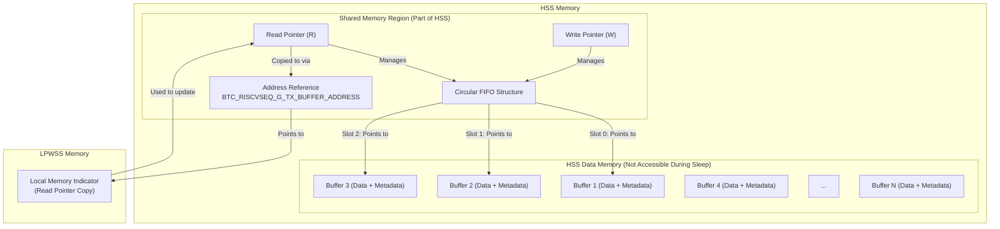
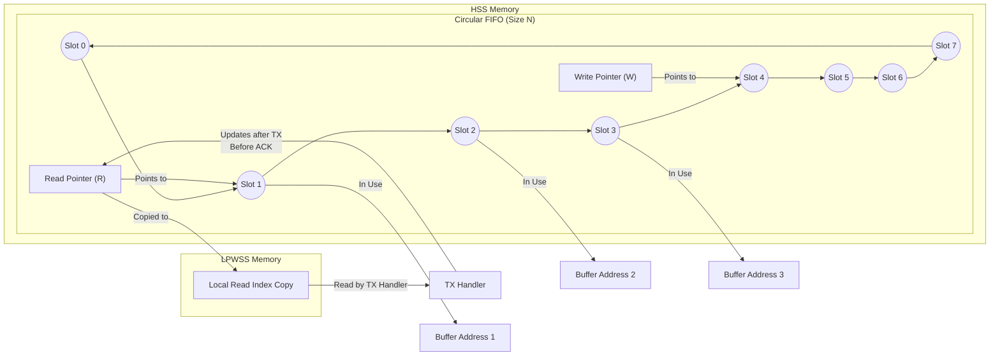

# Bluetooth Classic Data Path Design

---

## Recent Changes (2025-06-05)
- **Legacy bitmap/queue logic fully removed.** All buffer address passing now uses a power-of-two circular FIFO in shared memory, with wrap-around logic using bitwise AND. Buffer pool size always matches FIFO size (power of two).
- **Type safety improved:** All pointer/integer conversions use `uintptr_t`. Function signatures and usages updated for correct pointer types.
- **Global FIFO instance tracking:** Added `g_current_fifo_instance_id` in `btc_device.c` and a macro for global access to the current FIFO instance for LPWSS and application code.
- **API/function updates:** All buffer management functions (`enqueue_to_fifo`, `dequeue_from_fifo`, `verify_buffer_and_free`, etc.) now take an `instance_id` and use correct types. All usages of `get_shared_fifo_ptr` updated to return `buffer_fifo_t *`.
- **Buffer recycling/notification:** After buffer acknowledgment, buffer is cleared and a new buffer is created/enqueued to maintain pool size. Notification and pointer update logic is robust and documented.
- **Macros and address references:** `SET_TX_BUFFER_ADDRESS` and `GET_TX_BUFFER_ADDRESS` macros updated for type safety and instance support. Address reference calculation for each instance is documented and used in code.
- **Multi-instance/power-save support:** FIFO and buffer management system supports multiple instances (ACL/SCO), each with its own buffer pool and pointers. Both HSS and LPWSS can independently enter power save modes without data loss/corruption.
- **Buffer address handling:** Updated to use direct pointer operations for updating global buffer addresses and FIFO instance addresses. Removed unnecessary validation checks in favor of simpler, more direct address updates.
- **Memory management:** Added proper header includes for memory management functions and debug printing. Improved error handling and logging throughout the codebase.
- **Initialization changes:** Separated FIFO manager initialization into its own function `init_fifo_manager()` for better modularity and instance management.

---

## Overview
This document describes the Host Subsystem (HSS) to Low Power Wireless Subsystem (LPWSS) data path for Bluetooth Classic in a system where both subsystems can independently enter power save modes. In this architecture, HSS (which has more memory resources) stores the actual data buffers, while LPWSS is responsible for physical transmission of data. When LPWSS needs to transmit data, it accesses buffer information from HSS.

Key characteristics of this architecture:
- Both HSS and LPWSS can independently enter power save modes
- During power save in either subsystem, memory access between subsystems is not permitted
- Data buffers reside in HSS, which remains active during transmission
- LPWSS can enter sleep mode without affecting HSS operation
- LPWSS checks a local memory indicator to determine if HSS data is pending

The data communication between HSS and LPWSS occurs through a power-of-two circular FIFO where each entry contains the address of a data buffer, eliminating the need for bitmap or linked-list logic.

## Problem Statement
In our two-subsystem architecture (HSS and LPWSS), both subsystems need to operate independently while efficiently managing power consumption. The transmit data path requires buffers prepared in HSS with their addresses made available in LPWSS memory for hardware transmission. Due to power constraints, these subsystems must be able to enter sleep modes independently without losing data integrity.

HSS contains the data buffers and maintains the original copies until confirmation of successful transmission or timeout is received from LPWSS. LPWSS is responsible for data transmission and handling retries. Since direct memory access between subsystems is not permitted during power save modes, LPWSS needs a local indicator to determine if data is pending for transmission without waking HSS. Similarly, HSS should be able to enter sleep mode when no data is pending, without affecting LPWSS operations.

A tracking mechanism is required to manage buffers waiting in LPWSS for transmission and those successfully transmitted and ready to be freed. This mechanism must function reliably even when either subsystem enters power save mode.

## System Architecture



## Memory Access Patterns



## Data Flow Sequence



## Buffer Recycling Mechanism



## System Components and Responsibilities

### Host Subsystem (HSS)
- Contains more memory resources for data storage
- Manages buffer allocation and queueing
- Provides buffer pointers to LPWSS through a FIFO structure
- Can operate independently from LPWSS
- Maintains original buffer copies until transmission confirmation

### Low Power Wireless Subsystem (LPWSS)
- Has limited memory but handles physical data transmission
- Polls its local memory for pending buffer pointers
- Handles packet transmission and retries
- Notifies HSS when transmission is complete or failed
- Can operate independently without affecting HSS operations

### Communication
- HSS and LPWSS are compiled separately
- Communication occurs through a FIFO structure in shared memory
- Each FIFO entry contains the address of a data buffer in HSS
- Buffer address transfer uses address references
- The communication is asynchronous, with HSS managing the queue and LPWSS processing the data
- **A global variable (`g_current_fifo_instance_id`) is used to track the current FIFO manager instance, and its address is shared via a macro for LPWSS and application code to access the correct instance.**

### Tx Queue Management
- The Tx queue in HSS contains buffers using a scatter-gather architecture to optimize memory usage
- A dedicated Tx Buffer Converter component converts scatter-gather buffers into single linear buffers:
  - Scatter-gather buffers contain data fragments that may be stored non-contiguously in memory
  - The converter reads each fragment from the scatter-gather buffer
  - It allocates a single contiguous memory block for the linear buffer
  - It copies all fragments into this linear buffer in the correct order
  - Metadata from the original buffer is preserved and transferred to the linear buffer
- These linear buffers are placed in the FIFO for LPWSS to use for packet transmission
- This conversion ensures LPWSS can process the data efficiently during transmission with minimal memory operations
- The conversion happens just before the buffer address is enqueued in the shared FIFO
- The original scatter-gather buffer is retained until transmission confirmation from LPWSS

## Key Components
- **Queue Manager:** Handles transfer of data packets between asynchronous queues and the synchronous FIFO. Linear buffers are enqueued in the FIFO. **Legacy bitmap/queue logic is removed; all buffer management is via the FIFO.**
- **Shared Memory Region:** A designated area within HSS memory that is accessible by both HSS and LPWSS subsystems. This region contains the Circular FIFO structure, read and write pointers, and address references.
- **FIFO Pointers:** Located in the shared memory region of HSS, the Circular FIFO uses Read and Write pointers to manage buffer addresses. The Read pointer, which is updated by both HSS and LPWSS, tracks buffers that have been processed and can be freed. The Write pointer, managed exclusively by HSS, indicates where new buffer addresses should be added.
- **Local Memory Indicator:** LPWSS maintains a local copy of the Read pointer in its own memory space. HSS copies the Read pointer value to this indicator whenever new data is available, and LPWSS updates the actual Read pointer in shared memory after successful transmission before sending acknowledgment.
- **Address Reference:** `BTC_RISCVSEQ_G_TX_BUFFER_ADDRESS` contains the address of the Local Memory Indicator in LPWSS for the Read pointer copy. **A global variable (`g_current_fifo_instance_id`) is used to select the correct FIFO instance, and its address is provided via a macro for both LPWSS and application code.**
- **Linear Buffers:** Linear buffers with metadata and packet data used for data transfer to LPWSS, enqueued in the FIFO. The address of the FIFO is known to LPWSS. LPWSS will check the address reference before every tx and if the address is available the data packet corresponding to it will be processed.
- **Shared Memory FIFO:** Located in the shared memory region within HSS, it holds buffer addresses for transmission, managed as a circular buffer (FIFO) with a size of N entries (power of two). Enqueues buffer addresses with metadata (e.g., length, data pointer). Dequeues buffer addresses after Tx status from LPWSS; this dequeueing takes place in the process_mbox_msg handler present in lpw_to_host_mbox_interface.c.

## Module Responsibilities
- **Queue Manager:**
  - Dequeues asynchronous queues and enqueues buffer addresses into the shared memory FIFO.
  - Updates LPWSS about packet availability by copying the Read pointer to the LPWSS local memory indicator.
  - Manages the Write pointer for adding new buffer addresses to the FIFO.
  - Converts scatter-gather buffers from the Tx queue into single linear buffers for LPWSS consumption.
  - **All buffer management is via the FIFO; no bitmap or legacy queue logic remains.**
  - **All bool-returning buffer management functions now print errors for debugging.**
- **Tx Buffer Converter:**
  - Takes scatter-gather buffers from the Tx queue in HSS.
  - Consolidates fragmented data into a single contiguous linear buffer.
  - Prepares metadata appropriate for LPWSS processing.
  - Ensures efficient memory access for LPWSS transmission operations.
- **Shared Memory FIFO:**
  - Holds buffer addresses for transmission, managed as a circular buffer with N entries (power of two).
  - Uses Read and Write pointers to manage buffer flow between HSS and LPWSS.
  - Enqueues buffer addresses with metadata (e.g., length, data pointer).
  - Dequeues buffer addresses after Tx status from LPWSS; this dequeueing takes place in the process_mbox_msg handler present in lpw_to_host_mbox_interface.c.
- **Linear Buffers:**
  - Linear buffers are enqueued into the shared FIFO; their addresses are passed directly, no bitmap is used.
  - LPWSS checks the FIFO before every Tx for data processing.
  - Upon SUCCESS status, LPWSS returns the buffer address (or slot index) to HSS using RAIL_SEQ_SendMbox API.
  - HSS verifies the address, dequeues the buffer from the FIFO, and frees the buffer.
  - New linear buffers are dynamically created and enqueued to maintain a fixed queue size (configurable, default 2).
  - LPWSS processes one buffer at a time and only processes the second buffer after the first is freed.
  - **All pointer/integer conversions use `uintptr_t` for type safety.**

## Shared Memory Structure
The buffer address FIFO is implemented as a circular buffer in a shared memory region within HSS memory. This region is accessible by both HSS and LPWSS systems. The FIFO is managed using read and write pointers that reside within this shared memory, not as a linked list or bitmap. Buffer addresses are stored in slots within the circular buffer. All wrap-around logic uses bitwise AND with a mask, and the FIFO size is always a power of two. The buffer pool size matches the FIFO size. Both read and write pointers are physically located in the shared memory section of HSS memory but can be accessed by both subsystems.

## Memory Layout



## FIFO Operation



```c
// Example FIFO structure - Located in shared memory region within HSS
// All buffer address slots are type-safe (uintptr_t) and all wrap-around logic uses bitwise AND with a mask.
typedef struct {
    uintptr_t slots[FIFO_SIZE];  // Buffer address slots (Size N, power-of-two)
    uint32_t read_index;         // Located in shared memory, updated by both HSS and LPWSS
    uint32_t write_index;        // Located in shared memory, updated by HSS only
    uint32_t size;               // Number of slots (always power of two)
} buffer_fifo_t;
```

## Subsystem Independence

- HSS and LPWSS operate as independent systems with their own processing capabilities
- Communication occurs through the well-defined shared memory interface
- Each subsystem has its own memory regions with specific access patterns
- Data integrity is maintained through the FIFO structure and local indicators

## Tx Queue Management and Buffer Conversion

The Bluetooth Classic data path between HSS and LPWSS incorporates a specialized buffer management system to optimize memory usage while ensuring efficient data processing:

1. **Scatter-Gather Buffers in HSS**:
   - Data in the HSS Tx Queue is stored using scatter-gather architecture
   - This architecture allows for non-contiguous memory allocation, reducing fragmentation
   - Each buffer contains multiple segments (fragments) with pointers to each segment
   - This approach optimizes memory usage in HSS but would be inefficient for LPWSS to process

2. **Buffer Conversion Process**:
   - The Tx Buffer Converter component performs the critical task of converting scatter-gather buffers to linear format:
     - Reads the total data size from the scatter-gather buffer metadata
     - Allocates a single contiguous memory block of appropriate size for the linear buffer
     - Iterates through each fragment in the scatter-gather buffer
     - Copies all data into the linear buffer in the correct sequence
     - Preserves and transfers necessary metadata (packet type, length, etc.)
   - The resulting linear buffer contains all data in a single contiguous memory block

3. **Linear Buffer Enqueuing**:
   - The address of the newly created linear buffer is placed in the shared FIFO
   - The FIFO only stores buffer addresses, not the actual data
   - The Read Pointer is copied to the LPWSS Local Memory Indicator for efficient access

4. **Performance Considerations**:
   - Conversion happens on-demand, just before enqueuing in the FIFO
   - The original scatter-gather buffer is preserved until transmission confirmation
   - This dual-buffer approach balances memory efficiency in HSS with processing efficiency in LPWSS

This architecture ensures that LPWSS can access and process data efficiently during transmission while HSS maintains optimal memory usage.

## Implementation Details

### Implementation Key Points

- Data buffers are maintained exclusively in HSS memory due to its larger memory capacity
- The HSS Tx queue initially contains data as scatter-gather buffers to optimize memory usage
- A dedicated component converts these scatter-gather buffers into single contiguous linear buffers
- This conversion consolidates fragmented data before placing in the shared FIFO for LPWSS access
- Buffer addresses are communicated to LPWSS through a FIFO structure
- Before enqueuing a buffer address in the FIFO, HSS ensures the buffer contains valid data (`GET_PACKET_LEN(metadata) > 0`)
- The buffer pool and FIFO are always the same size (power of two), with no bitmap or linked list used
- LPWSS maintains a local indicator in its memory space that is updated by HSS to signal pending data
- The buffer address for LLC to process is communicated by HSS using the `SET_TX_BUFFER_ADDRESS()` macro
- LLC uses the `GET_TX_BUFFER_ADDRESS()` macro to retrieve the address from its Local Memory Indicator
- Upon receiving an acknowledgment, HSS dequeues the buffer from the FIFO, clears the buffer, and creates and enqueues a new buffer to maintain the pool size
- This recycling process ensures LPWSS always has access to buffers for data transfer, even when transitioning between power states
- All pointer/integer conversions use `uintptr_t` for type safety
- The buffer pool is never exhausted because buffers are always recycled after use
- Special handling ensures data integrity when either subsystem enters or exits power save mode
- A global variable (`g_current_fifo_instance_id`) is used to track the current FIFO manager instance
- All function signatures and calls for buffer management and initialization use instance IDs and buffer addresses
- All usages of `get_shared_fifo_ptr` match its return type (`buffer_fifo_t *`)
- Buffer address updates use direct pointer operations for simplicity and reliability
- FIFO manager initialization is now handled separately from instance initialization for better modularity

## Buffer Address Communication and Instance Tracking
- **Global Instance Variable:**
  - A global variable `g_current_fifo_instance_id` is defined in `btc_device.c` to track the current FIFO manager instance.
  - Its address is provided via a macro (e.g., `#define BTC_FIFO_INSTANCE_ID_ADDR ((uint32_t)&g_current_fifo_instance_id)`) for LPWSS and application code to access the correct FIFO instance.
  - This enables both LPWSS and application code to know which FIFO manager instance to refer to, using the shared memory address reference.
- **SET Macro:** ULC uses the macro defined in `tx_data_path.h`, updated to support multiple instances:
  ```c
  #define SET_TX_BUFFER_ADDRESS(addr_ref, addr) (*((uint32_t*)(addr_ref)) = (uint32_t)(addr))
  ```
  This writes the buffer address to the Local Memory Indicator in LPWSS referenced by an address reference calculated based on the instance ID.
- **GET Macro:** LLC uses the macro defined in `btc_rail_intf.h`, updated to support multiple instances:
  ```c
  #define GET_TX_BUFFER_ADDRESS(addr_ref) ((void*)(*((uint32_t*)(addr_ref))))
  ```
  This reads the buffer address from LPWSS's Local Memory Indicator via the instance-specific address reference.
- **Address Calculation:** For each connection instance (ACL/SCO), a separate address reference is calculated:
  ```c
  uint32_t addr_ref = BTC_RISCVSEQ_G_TX_BUFFER_ADDRESS + (instance_id * INSTANCE_OFFSET);
  ```
- **Instance Selection:**
  - LPWSS and application code can access the value of `g_current_fifo_instance_id` via its address macro, ensuring correct instance selection for all buffer management operations.
- **Note:** You cannot assign to `GET_TX_BUFFER_ADDRESS()`; use `SET_TX_BUFFER_ADDRESS(...)` to update the Local Memory Indicator.

## Buffer Freeing and Recycling
- When a buffer is acknowledged by LLC, HSS calls `verify_buffer_and_free(instance_id, buffer_addr)`, which:
  1. Finds the buffer in the pool by address.
  2. Clears the buffer's data and metadata.
  3. Creates and enqueues a new buffer to maintain the pool size.
- The loop index in `verify_buffer_and_free` is always local, not global.
- No buffer is re-enqueued directly; a new buffer is always created and enqueued.
- **All error conditions are logged for debugging.**

## API Reference
- `enqueue_to_fifo(uint8_t instance_id, void *buffer_addr)`: Enqueues a buffer address into the specified FIFO instance if space is available. Different instances correspond to different connection types (e.g., ACL/SCO connections). Returns `true` on success, `false` on error (with error print).
- `dequeue_from_fifo(uint8_t instance_id)`: Dequeues a buffer address from the specified FIFO instance and calls `verify_buffer_and_free`. Returns `true` on success, `false` on error (with error print).
- `verify_buffer_and_free(uint8_t instance_id, void *buffer_addr)`: Clears the buffer, creates and enqueues a new buffer for the specified instance, and checks for sleep conditions. Returns `true` on success, `false` on error (with error print).
- `get_shared_fifo_ptr(uint8_t instance_id)`: Returns a pointer to the shared FIFO structure for the specified connection instance.
- `update_lpwss_read_pointer(uint8_t instance_id, uint32_t read_index)`: Updates the LPWSS local memory indicator for the specified instance with the provided read index.
- **All function signatures and usages are updated for type safety and correct pointer usage.**

### Multiple Instance Support
The Shared Memory FIFO and Local Memory Indicator system supports multiple instances to handle different types of connections simultaneously:

- Each Bluetooth Classic ACL or SCO connection can have its own dedicated FIFO instance
- Each instance has its own buffer pool, read/write pointers, and local memory indicators
- The instance ID parameter in APIs identifies which connection the operation applies to
- Memory address offsets for each instance are calculated based on the instance ID
- This allows independent management of data flow for multiple connections without interference
- **The global variable and its address macro ensure correct instance selection in all code paths.**

## Example Code Snippet (Updated)
```c
// Core structures
typedef struct {
    uint32_t length;
    uint32_t data;                 // Data portion of the buffer
} linear_buffer_t;

typedef struct {
    uint32_t read_index;           // Current read position
    uint32_t write_index;          // Current write position
    uint32_t data_buffer[HSS_LPWSS_FIFO_SIZE]; // Buffer addresses
    uint32_t riscv_addr;           // RISC-V address for this FIFO
} buffer_fifo_t;

typedef struct {
    buffer_fifo_t fifo_instances[MAX_CONNECTION_INSTANCES];
    uint8_t active_instances;
    uint8_t is_instance_active[MAX_CONNECTION_INSTANCES];
} buffer_fifo_manager_t;

// Global manager
static buffer_fifo_manager_t fifo_manager;

// Core functions
void init_fifo_manager(void) {
    memset(&fifo_manager, 0, sizeof(buffer_fifo_manager_t));
    for (uint8_t id = 0; id < MAX_CONNECTION_INSTANCES; id++) {
        fifo_manager.fifo_instances[id].read_index = 0;
        fifo_manager.fifo_instances[id].write_index = 0;
        fifo_manager.fifo_instances[id].riscv_addr = 0;
    }
}

bool init_data_path(uint8_t instance_id, uint32_t riscv_memory_indicator_address) {
    if (instance_id < MAX_CONNECTION_INSTANCES && !fifo_manager.is_instance_active[instance_id]) {
        fifo_manager.is_instance_active[instance_id] = 1;
        fifo_manager.active_instances++;
        if (riscv_memory_indicator_address != 0) {
            fifo_manager.fifo_instances[instance_id].riscv_addr = riscv_memory_indicator_address;
        }
        return true;
    }
    return false;
}

buffer_fifo_t *get_shared_fifo_ptr(uint8_t instance_id) {
    if (instance_id < MAX_CONNECTION_INSTANCES && fifo_manager.is_instance_active[instance_id]) {
        return &fifo_manager.fifo_instances[instance_id];
    }
    return NULL;
}

bool enqueue_to_fifo(uint8_t instance_id, void *buffer_addr) {
    buffer_fifo_t *fifo = get_shared_fifo_ptr(instance_id);
    if (!fifo || ((fifo->write_index + 1 & HSS_LPWSS_FIFO_MASK) == (fifo->read_index & HSS_LPWSS_FIFO_MASK))) {
        return false;
    }
    fifo->data_buffer[fifo->write_index] = (uint32_t)buffer_addr;
    fifo->write_index = (fifo->write_index + 1) & HSS_LPWSS_FIFO_MASK;
    return true;
}

bool dequeue_from_fifo(uint8_t instance_id) {
    buffer_fifo_t *fifo = get_shared_fifo_ptr(instance_id);
    if (!fifo || (fifo->read_index & HSS_LPWSS_FIFO_MASK) == (fifo->write_index & HSS_LPWSS_FIFO_MASK)) {
        if (fifo) {
            fifo->riscv_addr = 0;  // Reset RISC-V address if FIFO is empty
        }
        return false;
    }
    linear_buffer_t *buffer = (linear_buffer_t *)(fifo->data_buffer[fifo->read_index]);
    fifo->read_index = (fifo->read_index + 1) & HSS_LPWSS_FIFO_MASK;
    return verify_buffer_and_free(instance_id, buffer);
}
```

---