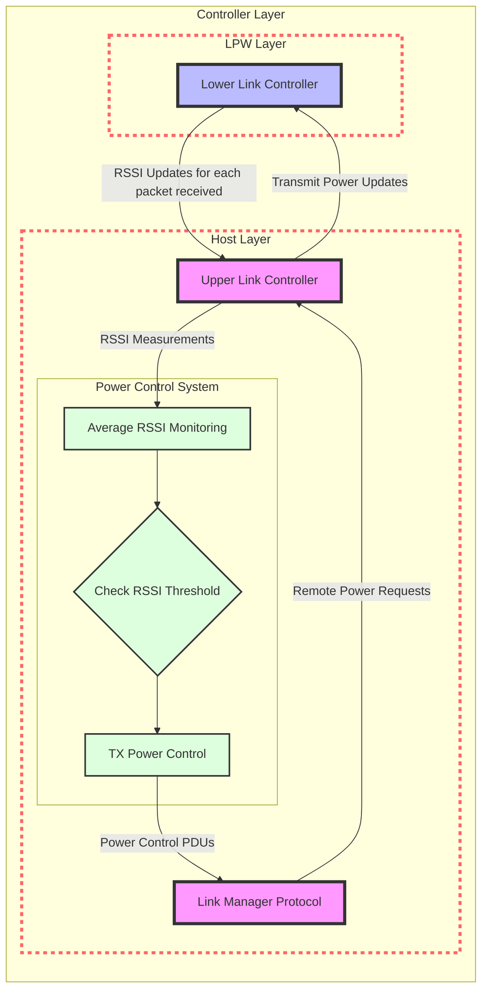

# Power Control in Bluetooth Classic

## Architecture Diagram

## Overview
Power control in Bluetooth Classic (BTC) enables dynamic adjustment of transmit power levels. The system supports:
- Transmit power range of -30 to 20 dBm in connections
- Transmit power range of -70 to 20 dBm for inquiry responses
- Default power settings based on country-region specific regulations
- Dynamic power adjustments based on RSSI measurements
- Power control through LMP (Link Manager Protocol) exchanges

## LMP Messages

### Legacy Power Control PDUs
- **LMP_INCR_POWER_REQ** - Uses step value
- **LMP_DECR_POWER_REQ** - Uses step value
- **LMP_MAX_POWER**
- **LMP_MIN_POWER**

### Enhanced Power Control PDUs
- **LMP_POWER_CONTROL_REQ**
- **LMP_POWER_CONTROL_RES**

### Important Notes
- Legacy power control is available from post-paging procedure until feature exchange
- If both devices support enhanced power control after feature exchange, legacy power control should not be used

## ULC-LLC Interactions

### ULC to LLC Communication
- Tx power updates for each connected device
- Separate inquiry response Tx power updates

### LLC to ULC Communication
- LLC calculates average RSSI value
- Reports average RSSI to ULC after every 100 transactions
- Separate reporting for each connected device

## Power Control in ULC

### RSSI-Based Power Adjustment
- ULC processes average RSSI values from LLC
- Compares against golden RSSI range
- Requests remote device power adjustments via LMP messages

### Remote Power Control Requests
- Processes incoming power increase/decrease requests
- Validates against maximum and minimum Tx power limits
- Updates device-specific Tx power when within limits
