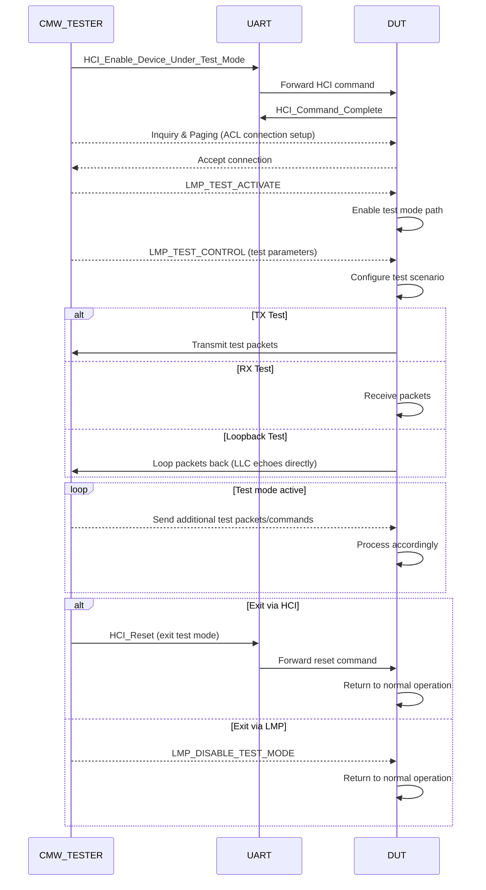
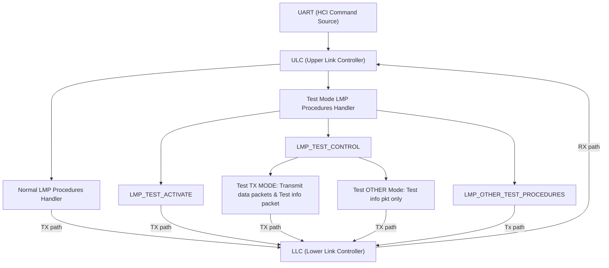

# Bluetooth Test Mode Flow

This document describes the Bluetooth Test Mode flow as per the Bluetooth specification, detailing the interaction between the CMW Tester (Central) and the DUT (Device Under Test).

---

**Acronyms Used:**
- **ULC**: Upper Link Controller
- **LLC**: Lower Link Controller
- **LMP**: Link Manager Protocol
- **HCI**: Host Controller Interface
- **DUT**: Device Under Test

---

### Bluetooth Test Mode Sequence (Specification-based)

1. **Test Mode Enable**: 
   - CMW Tester sends HCI_Enable_Device_Under_Test_Mode via UART to DUT.
   - DUT acknowledges and enters test mode.
2. **Connection Establishment**:
   - CMW Tester initiates Inquiry and Paging to establish a Bluetooth classic ACL connection with DUT.
3. **Test Mode Activation**:
   - CMW Tester sends LMP_TEST_ACTIVATE to DUT over the established ACL link.
   - DUT disables normal LMP processing and enables test mode path.
4. **Test Scenario Configuration**:
   - CMW Tester sends LMP_TEST_CONTROL with test parameters (e.g., TX frequency, packet type, power).
   - DUT parses and configures test scenario.
5. **Test Execution**:
   - If TX test: DUT transmits test packets as per configuration.
   - If RX test: DUT receives and counts packets.
   - If loopback: DUT loops packets back to tester.
6. **Continuous Testing**:
   - CMW Tester may send additional test packets or commands.
   - DUT continues test mode operation until exit command.
7. **Test Mode Exit**:
   - CMW Tester sends HCI_Reset or disables test mode through LMP also.
   - DUT returns to normal operation.

---

## Key HCI and LMP Commands in Test Mode

| Command                | Description                                      |
|------------------------|--------------------------------------------------|
| HCI_Enable_Device_Under_Test_Mode | Enables test mode on DUT via UART         |
| HCI_Reset                         | Exits test mode, resets DUT               |
| LMP_TEST_ACTIVATE                 | Activates test mode over ACL link         |
| LMP_TEST_CONTROL                  | Configures test parameters                |
| LMP_OTHER_TEST_PROCEDURES         | Handles other test scenarios              |

---

## Bluetooth Test Mode Sequence Diagram

_Legend:_
- **TX path**: Data sent from ULC to LLC for transmission
- **RX path**: Data received by LLC and sent to ULC
- **Test info pkt**: Test configuration information
- **Loopback**: LLC echoes received packets directly

---

## DUT Internal Design

DUT has two internal modules:
1. **ULC (Upper Link Controller)**  
   - Handles all LMP procedures and protocol management.
   - Contains two submodules:
     - **Normal LMP Procedures Handler:** Manages standard Bluetooth LMP operations.
     - **Test Mode LMP Procedures Handler:** Dedicated to handling test mode LMP procedures (e.g., LMP_TEST_ACTIVATE, LMP_TEST_CONTROL, other test procedures).
   - Receives packets from LLC (on-air packets) and through UART (HCI commands).
   - Monitors for exit commands and instructs LLC to restore normal operation when test mode ends.

2. **LLC (Lower Link Controller)**  
   - Responsible for Bluetooth radio configuration and hardware control based on requirements.
   - Handles the reception of packets (RX mode), counts/analyzes them, and transmits packets (TX mode) as instructed by ULC.
   - In loopback mode, LLC itself transmits the received RX packet back (echoes) without ULC intervention.

**Test Mode Data Flow:**
- ULC parses test info from LMP_TEST_CONTROL, checks the mode (TX, RX, Loopback), and sends relevant test mode info to LLC.
- LMP_TEST_CONTROL procedure handling:
    - If TX test: ULC gives the Test info pkt and TX packet to LLC
    - If other test mode: only gives the Test info pkt.
- TX path: Packets flow from ULC (via Normal/Test Mode LMP Handlers) to LLC.
- RX path: Packets flow from LLC to ULC.

**UART Path:**
- ULC receives HCI commands via UART.

---

